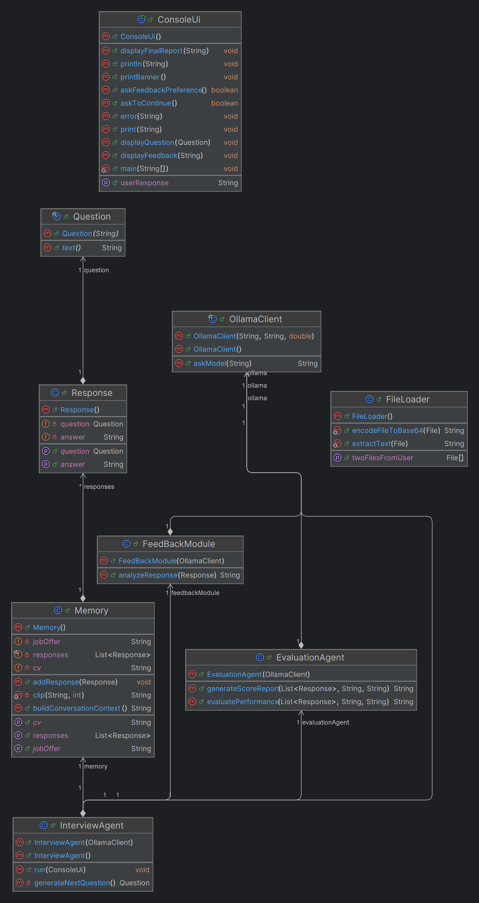
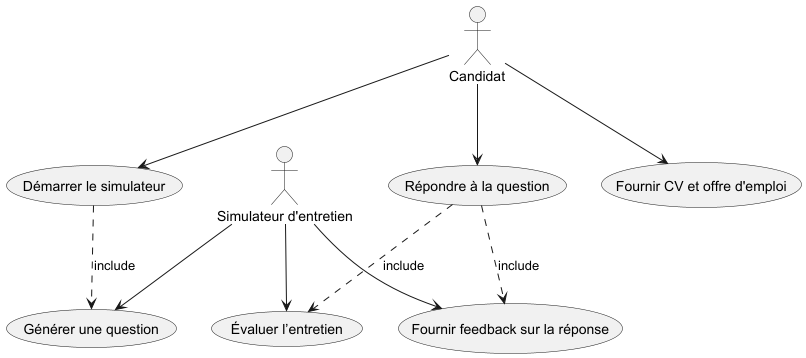

# Simulateur d’entretien IA – JavaInterviewAgentSimulator

## 🧠 Description

**JavaInterviewAgentSimulator** est un simulateur d’entretien d’embauche intelligent développé en Java.  
Il permet de **préparer des entretiens professionnels** en simulant un recruteur alimenté par un modèle d’IA.  
L’application fonctionne en console et utilise un modèle de langage via **Ollama** (connecté grâce à LangChain4J).

### Objectifs principaux :
- Générer des **questions d’entretien** à partir du CV et de l’offre d’emploi du candidat.
- Analyser les **réponses du candidat** et fournir un **feedback personnalisé**.
- Calculer un **score global de performance** et présenter un **rapport final** d’évaluation.
---

## 👤 Equipe :
| Prénom NOM    | Role                      |
|---------------|---------------------------|
| Antoine LALA  | Chef de projet            |
| Clément SAURY | Responsable Documentation |
| Enzo SOULIER  | Développeur               |
---

## 📊 Suivi du projet

[Document avec la gestion du projet](suivi_projet.md)

---
## ⚙️ Fonctionnalités

1. **Démarrage interactif**
    - Affiche un bandeau de bienvenue.
    - Permet de choisir si le candidat souhaite un feedback après chaque réponse.

2. **Import des fichiers**
    - Chargement du CV et de l’offre d’emploi (PDF ou texte).
    - Conversion en Base64 pour l’envoi au modèle IA.

3. **Simulation d’entretien**
    - Génération automatique de questions adaptées au profil.
    - Saisie des réponses en console.

4. **Feedback en temps réel**
    - Analyse qualitative des réponses.
    - Suggestions pour améliorer la communication et la pertinence.

5. **Évaluation finale**
    - Calcul d’un score global.
    - Affichage des points forts, axes d’amélioration et recommandations.
---

## 🏗️ Technologies utilisées

- **Java 21**
- **Spring Boot** – API REST et configuration
- **LangChain4J / Ollama** – Interaction avec le modèle IA
- **JUnit 5 / Mockito** – Tests unitaires
- **Apache PDFBox** – Lecture des fichiers PDF
- **Gradle** – Gestion de projet et des dépendances
---

## 🧩 Structure du projet

```
ace.projetprogpro/
├─ agent/                  # Logique principale de l’entretien
│  ├─ InterviewAgent.java
│  ├─ EvaluationAgent.java
│  ├─ FeedBackModule.java
│  ├─ Memory.java
│  ├─ FileLoader.java
├─ api/                    # Clients et contrôleurs REST
│  ├─ OllamaClient.java
├─ model/                  # Classes métiers
│  ├─ Question.java
│  ├─ Response.java
├─ ui/                     # Interface console
│  ├─ ConsoleUi.java
```

---

## 🚀 Installation et exécution

### 1. Cloner le projet
```
git clone https://github.com/ton-utilisateur/projetprogpro.git

cd projetprogpro
```

### 2. Compiler et installer les dépendances

```
./gradlew build
```
### 3. Lancer l’application
```
./gradlew bootRun
```
## 🧠 Guide Utilisateur

[Guide d'utilisation.md](guide_utilisateur.md)

---
## 🧪 Tests


### Des tests unitaires garantissent la fiabilité du simulateur.
### Pour les exécuter :

```
./gradlew test
```
### Couverture des tests :

**FileLoaderTest** : encodage Base64, fichiers vides, unicode, erreurs.

**InterviewAgentTest** : génération de questions via Ollama.

**FeedBackModuleTest** : analyse qualitative et suggestions.

**EvaluationAgentTest** : évaluation finale et rapport JSON.

## ⚙️ Configuration du modèle Ollama

### Le client Ollama est configurable via variables d’environnement ou System Properties.

```
Paramètre      Variable d’environnement	  Propriété système	Valeur par défaut
Base URL       OLLAMA_BASE_URL	          ollama.base-url	http://localhost:11434
Modèle         OLLAMA_MODEL	          ollama.model	        llama3.1:8b
Température    OLLAMA_TEMPERATURE	  ollama.temperature	0.3
```
## 🧱 Diagrammes UML

### Diagramme de classe :



### Diagramme de cas d'utilisation :


